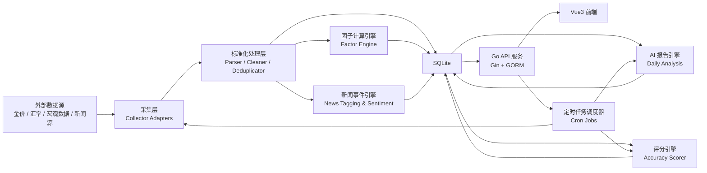

# 架构图与模块说明

## 1. 总体架构

## 2. 模块划分

### 2.1 后端模块

#### `source`

负责所有外部数据接入，建议按数据类型拆分适配器：

- `gold_source`: 实时黄金价格采集
- `fx_source`: 人民币汇率
- `macro_source`: 美元指数、利率、通胀、石油、股市
- `news_source`: 国内外新闻与行业事件
- `central_bank_source`: 央行购金与储备变化

要求：

- 支持主源 + 备用源
- 标准化原始数据格式
- 记录抓取时间、源地址、原始负载摘要

#### `service/collector`

负责采集编排：

- 调用 source 适配器
- 清洗无效数据
- 去重与异常值过滤
- 写入数据库
- 触发后续聚合和因子更新

#### `service/factor`

负责影响因子建模与统一评分：

- 将数值型数据映射为标准因子快照
- 将事件型数据映射为情绪与风险分值
- 计算因子对黄金的影响方向、强度、置信度
- 输出因子时间序列供图表展示

#### `service/news`

负责新闻事件处理：

- 新闻抓取
- 去重
- AI 摘要
- 情绪打标
- 因子关联
- 重要性分级

#### `service/report`

负责每日 AI 分析报告：

- 汇总价格、新闻、因子快照
- 组装模型输入
- 调用 AI 生成报告
- 输出趋势判断、关键逻辑、风险提示、预测区间
- 保存报告版本与模型信息

#### `service/scoring`

负责前一日报告自动评分：

- 对比预测方向与实际方向
- 对比预测区间与实际波动
- 评估核心因子命中程度
- 生成 `0-100` 分准确率
- 记录评分解释

#### `cron`

负责定时任务：

- 实时金价采集：建议 `10-60 秒`
- 新闻抓取：建议 `5-15 分钟`
- 因子快照更新：建议 `15-60 分钟`
- AI 日报生成：建议每日固定时间
- 准确率评分：建议次日固定时间

### 2.2 前端模块

#### `pages/Dashboard`

首页仪表盘，展示：

- 实时金价
- 今日走势
- 因子摘要
- 重要新闻
- 最新 AI 判断

#### `pages/PriceAnalysis`

价格走势页：

- 分时图 / K 线图
- 周期切换
- 技术指标占位
- 关键事件叠加标记

#### `pages/Factors`

因子页：

- 因子卡片
- 因子详情曲线
- 因子影响说明
- 因子与金价关联分析

#### `pages/News`

新闻事件页：

- 新闻流
- 影响等级
- 情绪方向
- 关联因子标签

#### `pages/Reports`

AI 报告页：

- 每日报告列表
- 详情页
- 准确率评分
- 准确率历史曲线

### 2.3 共享能力

#### 配置中心

- 数据源开关
- 抓取频率
- AI 模型参数
- 评分权重

#### 日志与监控

- 采集成功率
- 报告生成状态
- 定时任务耗时
- 数据延迟告警

## 3. 数据流说明

### 3.1 实时价格流

1. 采集器拉取外部金价。
2. 标准化为 `CNY/g`。
3. 写入 `gold_price_ticks`。
4. 聚合生成分钟级 / 小时级 / 日级 K 线。
5. 推送给前端图表。

### 3.2 新闻流

1. 定时拉取新闻源。
2. 去重与正文清洗。
3. AI 提取摘要、情绪、影响因子。
4. 存入 `news_articles`。
5. 前端按重要性与时间展示。

### 3.3 因子流

1. 拉取宏观与市场数据。
2. 归一化为统一因子编码。
3. 计算方向、强弱、置信度。
4. 存入 `factor_snapshots`。
5. 与黄金价格联动展示。

### 3.4 报告与评分流

1. 每日汇总价格、新闻、因子快照。
2. AI 生成次日走势分析。
3. 次日根据真实数据自动评分。
4. 评分写入数据库并更新历史准确率曲线。

## 4. 模块边界建议

- 采集层只负责“拿到数据”，不承担业务判断。
- 因子引擎负责“统一解释数据”。
- AI 报告服务只消费结构化输入，不直接抓取原始源数据。
- 评分引擎只对“已发布报告”评分，避免回看污染。
- 前端只消费 API，不直接连外部数据源。

## 5. 非功能要求

- 单机可部署，优先保证简单稳定。
- 所有任务具备重试与失败日志。
- 关键表增加时间索引，保证图表与报告查询性能。
- AI 输出必须保留原始提示词摘要、模型版本与生成时间。
